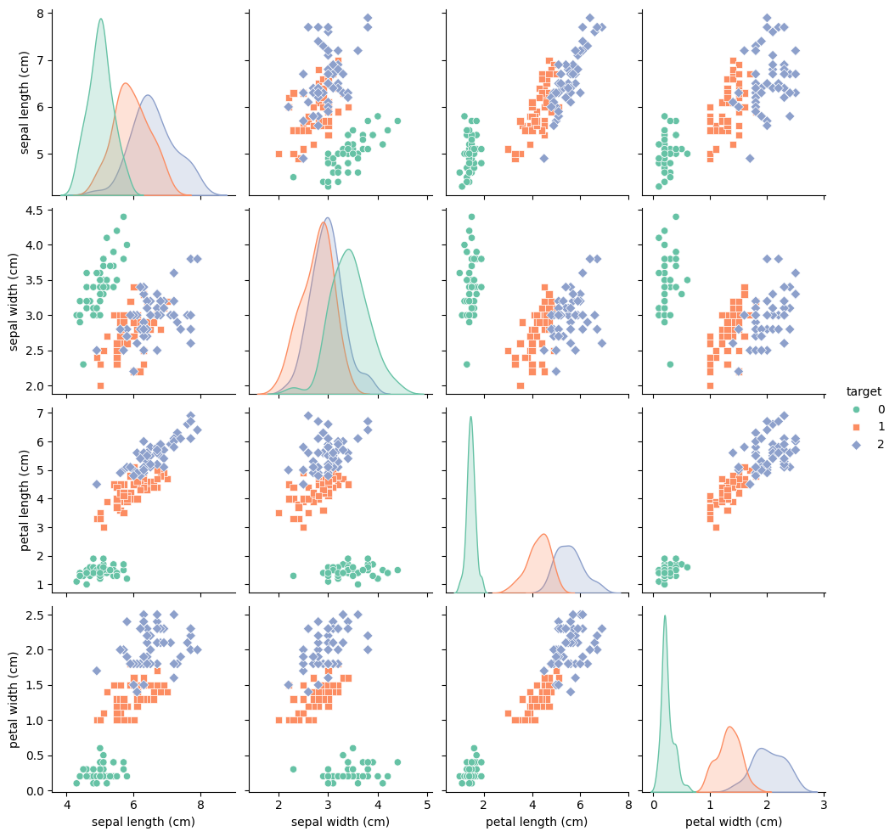

# API de Clasificación de Iris

Este proyecto demuestra un pipeline completo para crear un modelo de Machine Learning utilizando el conjunto de datos Iris, implementarlo mediante una API RESTful desarrollada con FastAPI y contenerizar la aplicación utilizando Docker.

---

## **Características**

- Entrenamiento de un modelo de clasificación (por ejemplo, Árbol de Decisión) utilizando el conjunto de datos Iris.
- Servicio de predicciones a través de una API basada en FastAPI.
- Contenerización con Docker para facilitar el despliegue.

---

## **Estructura del Proyecto**

1. **Directorio principal:** Contiene los archivos esenciales del proyecto, como el código fuente y la configuración de Docker.
2. **FastAPI Application:** Implementa la API para servir las predicciones del modelo.
3. **Modelo de Machine Learning:** Entrenado en el conjunto de datos Iris y exportado como archivo serializado (por ejemplo, formato `.pkl`).

---

## **Conjunto de Datos Iris**

El conjunto de datos Iris es un dataset ampliamente utilizado en proyectos de Machine Learning para clasificación. Contiene información sobre tres especies de flores: *Iris-setosa*, *Iris-versicolor* e *Iris-virginica*. Incluye 150 muestras con las siguientes características:

- **Longitud del sépalo** (Sepal Length)
- **Ancho del sépalo** (Sepal Width)
- **Longitud del pétalo** (Petal Length)
- **Ancho del pétalo** (Petal Width)
- **Clase**: La especie de la flor.

### **Ejemplo del Dataset:**

| Longitud del sépalo | Ancho del sépalo | Longitud del pétalo | Ancho del pétalo | Clase          |
|---------------------|------------------|---------------------|------------------|----------------|
| 5.1                 | 3.5              | 1.4                 | 0.2              | Iris-setosa    |
| 7.0                 | 3.2              | 4.7                 | 1.4              | Iris-versicolor|
| 6.3                 | 3.3              | 6.0                 | 2.5              | Iris-virginica |

---

## **Instrucciones para la Ejecución**

### **Requisitos previos**

- **Python 3.8 o superior**
- **Docker instalado**
- Paquetes requeridos en `requirements.txt` (FastAPI, scikit-learn, etc.)

### **Pasos**

1. **Clonar el repositorio:**
   ```bash
   git clone https://github.com/JuanDaGue/iris-api.git iris-api
   cd iris-api

2. ** Construir el contenedor Docker:**
    ```bash
    docker buildx build -t "iris:iris" .

2. ** Ejecutar el contenedor:**
    ```bash
    docker run -d -p 8000:8000 --name contenedoriris iris:iris

4. ** Acceder a la API:**
    ```bash
    URL base: http://localhost:8000
    Documentación interactiva: http://localhost:8000/docs.

## **Uso de la API**

**POST /predict**

### Entrada:

JSON con las medidas de sépalo y pétalo.
```json
{
  "sepal_length": 5.1,
  "sepal_width": 3.5,
  "petal_length": 1.4,
  "petal_width": 0.2
}
```

**Salida**: Especie predicha (Iris-setosa, Iris-versicolor o Iris-virginica).
```json
{
    "prediction": "Iris-setosa"
}
```

## Tecnologías Utilizadas
    -**FastAPI**: Framework para construir APIs modernas y rápidas.
    - **Scikit-learn**: Librería para entrenar el modelo de clasificación.
    - **Docker**: Para contenerización y despliegue.

## Pruebas Unitarias del Endpoint

Para realizar las pruebas unitarias, ejecuta el siguiente comando en la terminal:
```bash
pytest tests/test_predict_endpoint.py


## Analisis exploratoria de los graficos 

para encontrar el analisis exploratorio de los datos visita la sigueinte ruta
```
models/notebooks/01_data_exploration.ipynb


